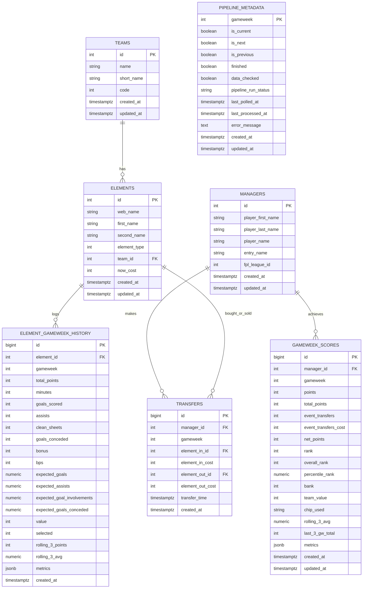

# Database Entity-Relationship Diagram (ERD) & Join Architecture

> **Document Type:** Database Architecture & Schema Specification  
> **Status:** Implemented (Phase 2)  
> **DDL Source:** [`infrastructure/sql/init.sql`](file:///Users/vvohra/Workspaces/personal-projects/fpl_dashboard/infrastructure/sql/init.sql)  
> **ORM Models:** [`backend/app/models/`](file:///Users/vvohra/Workspaces/personal-projects/fpl_dashboard/backend/app/models/)  

---

## 1. Visual Entity-Relationship Diagram (ERD)



---

## 2. Relational Domains & Join Map

The database is divided into **two core relational domains** plus **one orchestration state table**:

### Domain A: Premier League & Player Registry
| Source Table | Joined Table | Join Key | Cardinality | Purpose & Description |
| :--- | :--- | :--- | :--- | :--- |
| `teams` | `elements` | `elements.team_id = teams.id` | 1-to-Many | Maps every player to their Premier League club (e.g., Saka -> Arsenal). `ON DELETE CASCADE`. |
| `elements` | `element_gameweek_history` | `element_gameweek_history.element_id = elements.id` | 1-to-Many | Connects individual players to their weekly performance logs (minutes, points, xG, xA). `ON DELETE CASCADE`. |

### Domain B: Mini-League Managers & Competitions
| Source Table | Joined Table | Join Key | Cardinality | Purpose & Description |
| :--- | :--- | :--- | :--- | :--- |
| `managers` | `gameweek_scores` | `gameweek_scores.manager_id = managers.id` | 1-to-Many | Connects mini-league managers to their 38 weekly scorecards (net points, hits, chips, rolling form). `ON DELETE CASCADE`. |
| `managers` | `transfers` | `transfers.manager_id = managers.id` | 1-to-Many | Connects managers to their post-deadline transfer events. `ON DELETE CASCADE`. |
| `transfers` | `elements` (Incoming) | `transfers.element_in_id = elements.id` | Many-to-1 | Resolves player ID to player display name for the incoming player bought. `ON DELETE RESTRICT`. |
| `transfers` | `elements` (Outgoing) | `transfers.element_out_id = elements.id` | Many-to-1 | Resolves player ID to player display name for the outgoing player sold. `ON DELETE RESTRICT`. |

### Domain C: Pipeline Orchestration & State
| Table | Join Keys | Purpose & Description |
| :--- | :--- | :--- |
| `pipeline_metadata` | *None (Standalone)* | Central control switch for the ETL pipeline. Tracks whether each gameweek has finalized (`finished`, `data_checked`) and logs pipeline execution state (`PENDING`, `RUNNING`, `COMPLETED`, `FAILED`). |

---

## 3. Real-World SQL Join Patterns

### Pattern 1: Standings Leaderboard with Net Points & Form
Retrieves manager rankings for a specific gameweek with transfer hits deducted and rolling 3-game average form:
```sql
SELECT 
    m.id AS manager_id,
    m.player_name,
    m.entry_name,
    g.gameweek,
    g.points AS raw_points,
    g.event_transfers_cost AS hit_cost,
    g.net_points,
    g.rolling_3_avg AS form_rating,
    g.chip_used,
    g.metrics->>'running_net_points' AS running_net_points
FROM managers m
JOIN gameweek_scores g ON m.id = g.manager_id
WHERE g.gameweek = 5 AND m.fpl_league_id = 944559
ORDER BY g.net_points DESC;
```

### Pattern 2: Post-Deadline Rival Transfer Timeline
Renders the rival news feed showing who bought and sold whom after the gameweek deadline locked:
```sql
SELECT 
    m.player_name,
    m.entry_name,
    t.gameweek,
    p_in.web_name AS player_bought,
    t.element_in_cost / 10.0 AS buy_price_m,
    p_out.web_name AS player_sold,
    t.element_out_cost / 10.0 AS sell_price_m,
    t.transfer_time
FROM transfers t
JOIN managers m ON t.manager_id = m.id
JOIN elements p_in ON t.element_in_id = p_in.id
JOIN elements p_out ON t.element_out_id = p_out.id
WHERE t.gameweek = 5 AND m.fpl_league_id = 944559
ORDER BY t.transfer_time DESC;
```

### Pattern 3: Player Gameweek History with Club Information
Fetches player stats alongside club abbreviation for player detail cards:
```sql
SELECT 
    e.web_name AS player_name,
    tm.short_name AS club,
    h.gameweek,
    h.total_points,
    h.minutes,
    h.expected_goals AS xG,
    h.expected_assists AS xA,
    h.rolling_3_avg AS rolling_form
FROM element_gameweek_history h
JOIN elements e ON h.element_id = e.id
JOIN teams tm ON e.team_id = tm.id
WHERE e.id = 350
ORDER BY h.gameweek ASC;
```

---

## 4. Integrity Constraints & Performance Indexes

### Unique Constraints (Duplicate Prevention)
* `uq_manager_gameweek` ON `gameweek_scores(manager_id, gameweek)`: Ensures a manager has at most one score entry per gameweek.
* `uq_element_gameweek` ON `element_gameweek_history(element_id, gameweek)`: Guarantees one box score per player per gameweek.
* `uq_transfer_event` ON `transfers(manager_id, gameweek, element_in_id, element_out_id, transfer_time)`: Idempotency protection against duplicate transfer rows.

### Performance Indexes
* **B-Tree Indexes:** Optimized lookups for `elements(team_id)`, `elements(element_type)`, `managers(fpl_league_id)`, `gameweek_scores(manager_id, gameweek)`, and `transfers(manager_id, gameweek)`.
* **GIN Indexes (JSONB):** `idx_gw_scores_metrics` and `idx_element_gw_hist_metrics` allow sub-millisecond querying inside JSONB payload attributes.
